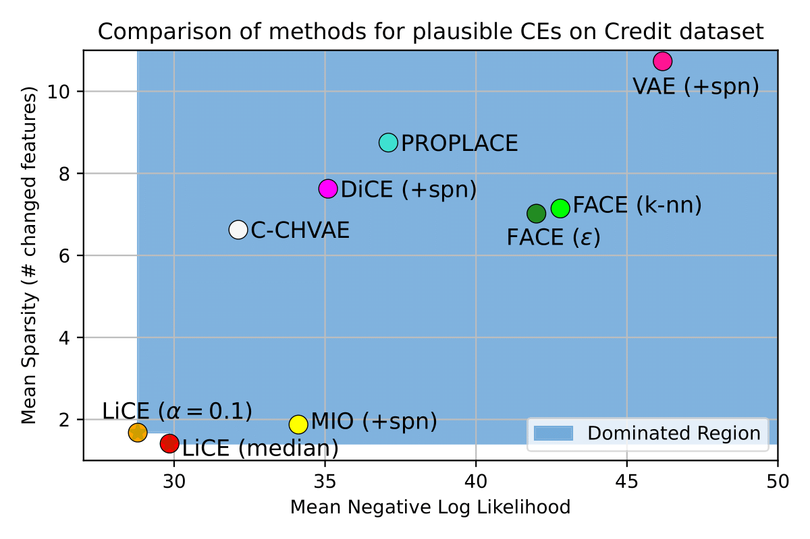

# LiCE: Likely Counterfactual Explanations

LiCE is a method utilizing Mixed-Integer Optimization (MIO) to provide local Counterfactual Explanations (CEs) of a trained Neural Network classifier (multiple other ML classifiers are possible to be added with little coding effort, contact us, if help is needed).

It uses a trained Sum-Product Network (SPN) to estimate the likelihood of the CE. We approximate the within MIO, enabling us to optimize a combination of plausibility (likelihood) and similarity (distance from the original sample).

Our method pareto-dominates comparable methods focusing on plausibility.

LiCE achieves high likelihood (plausibility) and low sparsity (few generated attributes).

For a simple example of how to use our method, see the `example.ipynb` Jupyter Notebook.

## Paper information

This is the official Python implementation of the LiCE method introduced in the paper [_Generating Likely Counterfactuals Using Sum-Product Networks_](https://openreview.net/pdf?id=rGyi8NNqB0).

Or see this 5-minute [video explanation](https://recorder-v3.slideslive.com/?share=98724&s=2b116c67-577b-4c90-90fa-c37550a4c7a1) of our paper.

Cite our work using this BibTeX:

```bibtex
@inproceedings{
    nemecek2025generating,
    title={Generating Likely Counterfactuals Using Sum-Product Networks},
    author={Ji{\v{r}}{\'\i} N{\v{e}}me{\v{c}}ek and Tom{\'a}{\v{s}} Pevn{\'y} and Jakub Mare{\v{c}}ek},
    booktitle={The Thirteenth International Conference on Learning Representations},
    year={2025},
    url={https://openreview.net/forum?id=rGyi8NNqB0}
}
```

## Reproducibility information

The method implementation itself is in the `LiCE` directory, including the implementation of the Mixed polytope encoding.

Other methods we compare to are either packages or in the folder `compared_methods`.

The directory `results` then contains the results.

Evaluations presented in the paper were performed using the scripts `2_run_experiments_LiCE.py`, `2_run_experiments_other_py311.py`, and `2_run_experiments_other_py37.py`, the latter of which corresponds to experiments using the CARLA library and PROPLACE, as they, unfortunately, do not support new versions of Python and other libraries. This meant that the experiments have to be performed separately. We also provide two sets of requirements, one for the python 3.7 run and another for everything else.

### Data

The folders `data` contains data of the GMSC dataset (rest is accessed using a library), and `data_config` contains the configuration of each specific dataset.

To run LiCE on your dataset, first set up a configuration for it, similar to the ones in `data_config`.

### Usage

As mentioned, we provide 2 sets of requirements, so we create 2 separate conda environments.

To run LiCE (and some other methods) the requirements are in `requirements.txt` file.
LiCE uses the [Gurobi solver](http://www.gurobi.com/) for the MIP solver. This can be changed in the `solver_name` parameter to the method `generate_counterfactual`, however some gurobi-specific settings will not work.

```sh
conda create -n "LiCE_env" python==3.11
conda activate LiCE_env
pip install -r requirements.txt # assuming working directory is this one
# prepare data splits and models (NN, SPN...)
python 1_initialize_data_and_models.py
# rerun the experiments - requires setting up gurobi license

# python 2_run_experiments_LiCE.py <time limit> {credit,adult,gmsc} {0..4} {median,quartile,optimize,other}
python 2_run_experiments_LiCE.py 120 credit 0 median # e.g.

# rerun the experiments for other methods
pip install typing_extensions==4.11.0 # requirement of the local downgraded dice version
# python 2_run_experiments_other_py311.py {credit,adult,gmsc} {0..4}
python 2_run_experiments_other_py311.py # DiCE needs extra edits, see below

# evaluate the counterfactuals
python 3_evaluate_CEs.py
# and see the results
jupyter lab # and open the 4_*.ipynb notebooks to visualize and produce tables
```

FACE, C-CHVAE and PROPLACE require an older version of Python (3.7.16). The setup process is complicated and prone to errors.

```sh
conda create -n "LiCE_env37" python==3.7.16
conda activate LiCE_env37

pip install git+https://github.com/carla-recourse/CARLA.git@24db00aa8616eb2faedea0d6edf6e307cee9d192
# upgrade packages
pip install tensorflow==1.15
pip install scikit-learn==1.0.2
pip install torch==1.13.1
pip install numpy==1.21.6
# proplace requirements
pip install gurobipy==10.0.3
pip install alibi==0.9.3

# rerun the experiments for methods using python 3.7

# python 2_run_experiments_other_py37.py {credit,adult,gmsc} {0..4} {proplace,carla}
python 2_run_experiments_other_py37.py credit 0 proplace
```

This is not required to test the LiCE method.

#### Extra edits

To set all methods in motion, we needed to make some edits. Firstly, we use a downgraded version (0.4) of the DiCE library (additionally edited by us) as a local copy in the `dice_ml_04` folder.

On top of that, there is one change required for the newer (version 0.11) DiCE library to allow for an inverse transformation of the data. It is described in the code and is rather simple to perform on your local machine. The change required is on line 329 of the `dice_ml/utils/helpers.py` file, in the function `initialize_transform_func(self)`. If one is using a custom function, add the inverse function as well

```python
self.data_transformer = FunctionTransformer(func=self.func, inverse_func=self.kw_args["inverse_func"], kw_args=self.kw_args, validate=False)
# above is the edited line, arrows point to the edit        ^^^^^^^^^^^^^^^^^^^^^^^^^^^^^^^^^^^^^^^^^^
```

Link to github repository reference to the line: https://github.com/interpretml/DiCE/blob/48832802c2a0822a9b203f3057e6def9e8ba0d0a/dice_ml/utils/helpers.py#L329C12-L329C12

Note that **none** of these changes or additional libraries are required for LiCE itself to work, it is a standalone implementation.

## Evaluation on Bayesian Networks

All related files are in the `BN_evals` folder.
